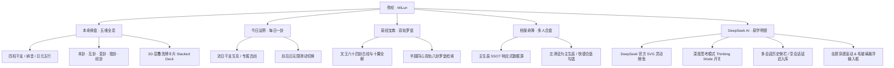

# 🌌 弥纶 · MiLun
### —— 语出《周易·系辞》“易与天地准，故能弥纶天地之道”

<p align="center">
  <strong>弥纶天地 · 洞见真我 · 融汇大衍筮法与 DeepSeek 前沿认知智能</strong>
</p>

<p align="center">
  
  
  
  
  
  
  
</p>

---

## 📖 释名与简介

> **“《易》与天地准，故能弥纶天地之道。”** ——《周易·系辞上》
> 
> *弥者，弥缝补缺、包罗万象也；纶者，纲领经纬、经纶世务也。*

**「弥纶 · MiLun」** 是一款以中国先秦古籍《周易》为哲学底座，结合传统干支历法、四柱八字纳音、大衍筮法数理与现代 **DeepSeek 大语言模型** 的全息命理研判与决策指引系统。

本应用摒弃了传统命理软件粗糙机械的断语倾倒与生硬渐变，独创 **「雅秋 (Autumn Grace)」立体光影美学**，以温润的古金、朱砂、墨黑与翡翠色调，配合柔和的拟物层叠与悬浮微交互，为用户提供科学严谨、沉浸典雅的东方智慧研习与命理参详体验。

---

## ✨ 核心功能全景



---

### 1. 🎴 本命全息排盘 (Destiny Hologram)
- **精准四柱天干地支推算**：支持年、月、日、时四柱八字排盘，支持早夜子时换日考量、真太阳时纠偏与未知时辰智能容错。
- **日元强弱与五行量化**：自动分析日主五行（木火土金水）分布比例，配备可视化五行能量占比条与纳音释义。
- **五维立体时空卦象模型**：
  - **【本卦】**：立足当下，明晰先天根基与现状；
  - **【互卦】**：洞察事物深层演变机理与内在核心动机；
  - **【变卦】**：结合动爻变易，预测未来发展趋势与终局；
  - **【错卦】**：正反镜鉴，审视对立面潜藏的危机与盲区；
  - **【综卦】**：换位逆向思考，寻找逆境破局通道。
- **3D 拟物层叠切牌交互 (`StackedWisdomDeck`)**：以层叠洗牌交互呈现卦辞与爻辞，支持手指顺畅拖拽、切牌与翻牌。

---

### 2. 📅 今日运势 · 每日一卦 (Daily Hexagram)
- **流日时空与本命实时联动**：基于当日干支与用户本命五行生克推衍每日卦象，提供宜忌提点与处世修身吉训。
- **平滑双向时光穿梭**：支持左划/右划手势或前一日/后一日按钮无缝切换查阅历史与未来运势。

---

### 3. 📜 易经宝典 · 六十四卦全书 (I Ching Canon)
- **完整权威典籍收录**：收录文王六十四卦古经原文、卦辞、爻辞，并深度解析孔子《易传·十翼》（彖辞、象辞、文言、系辞）。
- **半圆同心双轨八卦罗盘 (`SemiCircleFilterWheel`)**：
  - 外轨与内轨分别代表上卦（外卦）与下卦（内卦）；
  - 旋转拨动八卦方位（乾、兑、离、震、巽、坎、艮、坤），毫秒级极速定位目标卦象。
- **十二时辰典籍反推助手**：内置传统时辰对照表，支持通过身体特征、作息节律反推生辰时刻。

---

### 4. 👥 档案命簿与多人管理 (Multi-Profile SSOT)
- **单一数据源响应式架构 (`ProfileRepository`)**：主生辰档案变更时，全站排盘、运势、AI 载荷实时自动重算联动。
- **亲友档案管理**：支持无限量录入家人、朋友、合伙人生辰数据，侧滑即可一键设为主生辰或删除。
- **浑天罗盘日期选择器 (`RotaryDatePickerDialog`)**：独创同心环罗盘交互，自「年份 ➔ 月份 ➔ 日期 ➔ 时辰」逐级旋转确认，支持干支即时变换与公历/农历一键切换。

---

### 5. 🧠 DeepSeek AI 易学参详明镜 (DeepSeek AI Hub)
- **官方原生矢量鲸鱼**：全站直接集成 DeepSeek 官方标准 SVG 原版矢量图标。
- **深度思考模式 (`Thinking Mode`) 开关**：
  - 🧠 **深度思考**：请求体开启 `thinking: {"type": "enabled"}`，流式输出完整逻辑推理思维链（`reasoning_content`），以折叠卡片清晰呈现推导演算过程；
  - ⚡ **极速直接**：请求体传入 `thinking: {"type": "disabled"}`，零思考耗时直接输出精准决策报告。
- **动态获取官方模型**：自动连通 DeepSeek 官方 API 获取最新可用模型矩阵（如 `deepseek-v4-flash`, `deepseek-v4-pro` 等），并在标题正中实时展示状态。
- **多人合盘与主客体显式标记**：可随时自由勾选多位对比亲友档案，结构化传入 AI 进行合伙经商、姻缘相合、团队搭配等多维合盘参详。
- **Markdown 富文本引擎排版**：全面支持各级标题、金色重点高亮、引用块古金侧条、列表与表格排版，支持全局划词选择与自由复制。
- **多会话侧栏管理与延迟落库**：
  - 左上角抽屉随时调出历史会话，自由切换或防误触二次确认删除；
  - 新建对话采用**内存草稿模式**，未输入发送文字前不产生空白无用记录，首条消息发出后智能提炼会话标题并持久化。
- **真正全屏穿透滚动 & 毛玻璃悬浮输入栏**：
  - 输入栏采用 `BackdropFilter` 16px 高斯模糊半透明圆角卡片悬浮于视口上方；
  - 消息列表全屏纵贯穿透，可在输入框下方自如滑行并由四周边缘透出；
  - 输入框支持 **1~6 行长文本动态自适应伸缩增高**。

---

## 🎨 设计美学 ——「雅秋 (Autumn Grace)」

应用严格遵循 **去模板化、重立体感、沉浸东方质感** 的美学原则：

| 元素 | 设计落地 |
| :--- | :--- |
| **主色调** | **雅秋金棕** (`#C79A46` / `#E5C378`) 搭配 **深炭墨黑** (`#161618`) 与 **素雪宣纸** (`#FAF8F5`) |
| **点缀色** | **朱砂正红** (`#C23A2B`) 用于警示避讳与动爻变爻；**翡翠幽绿** (`#2E6B55`) 用于生机吉象与思维链 |
| **立体光影** | 杜绝大面积生硬边框，通过 **双层多级柔和弥散阴影 (`BoxShadow`)** 营造悬浮、凸起与沉陷的拟物层次 |
| **悬浮组件** | 导航栏与输入框均采用 **悬浮圆角胶囊 (`BorderRadius: 28-30px`)**，与页面内容形成纵深视觉差 |

---

## 🛠️ 技术栈与依赖

| 模块 | 选型与库 | 说明 |
| :--- | :--- | :--- |
| **核心框架** | Flutter 3.x / Dart 3.x | 高性能跨平台移动端应用 |
| **矢量渲染** | `flutter_svg: ^2.3.0` | DeepSeek 官方原版 SVG 矢量无损缩放渲染 |
| **富文本排版** | `flutter_markdown: ^0.7.7+1` | AI 易学分析报告 Markdown 结构化呈现 |
| **历法算法** | `lunar: ^1.4.1` | 权威高精度公农历转换、节气八字与干支计算 |
| **本地存储** | `shared_preferences: ^2.3.2` | 命簿档案、多会话记录、API 密钥与偏好设置持久化 |
| **日期格式化** | `intl: ^0.19.0` | 时区、时间戳与国际化日期格式化工具 |

---

## 📂 项目工程结构

```text
lib/
├── core/                         # 核心底层引擎
│   ├── ai/                       # DeepSeek API 交互服务与学术 Prompt 构建
│   │   └── deepseek_service.dart
│   ├── calendar/                 # 历法与八字排盘计算核心
│   │   └── bazi_engine.dart
│   └── iching/                   # 六十四卦大衍筮法与五维卦象推算
│       └── iching_calculator.dart
├── data/                         # 数据层 (模型与仓库)
│   ├── models/                   # 数据模型 (UserProfile, Hexagram, AiChatMessage, AiChatSession)
│   └── repositories/             # 单例数据仓储 (ProfileRepository, AiChatRepository, IChingRepository)
├── presentation/                 # 表现层 (UI/页面与组件)
│   ├── pages/
│   │   ├── ai/                   # AI 易学参详独立页面、设置弹窗
│   │   │   ├── ai_analysis_page.dart
│   │   │   └── ai_settings_dialog.dart
│   │   ├── archive/              # 档案命簿管理与编辑
│   │   ├── divination/           # 本命全息排盘展示页
│   │   ├── iching_canon/         # 易经六十四卦宝典与卦象详情
│   │   └── hour_finder/          # 十二时辰典籍反推工具
│   ├── theme/                    # 雅秋设计系统色彩与阴影规范 (AppTheme)
│   └── widgets/                  # 自定义高级 UI 组件
│       ├── deepseek_whale_icon.dart   # DeepSeek 官方原版矢量鲸鱼组件
│       ├── floating_nav_bar.dart      # 悬浮圆角跟手滑动导航栏
│       ├── rotary_date_picker.dart    # 浑天同心罗盘日期选择器
│       ├── semi_circle_wheel.dart     # 半圆同心双轨八卦筛选器
│       └── stacked_wisdom_deck.dart   # 3D 层叠切牌洗牌卡片
└── main.dart                     # 应用程序入口与单例仓库全局初始化
```

---

## 🚀 快速开始与编译部署

### 1. 环境准备
- 安装 [Flutter SDK](https://flutter.dev/docs/get-started/install) (建议版本 `>= 3.19.0`)
- 安装 Android Studio / Xcode 及对应平台构建工具链

### 2. 获取代码与依赖安装
```bash
# 进入项目根目录
cd WhoAmI

# 获取依赖包
flutter pub get
```

### 3. 本地开发与调试
```bash
# 启动本地开发调试 (支持热重载 Hot Reload)
flutter run
```

### 4. 运行全套自动化测试与代码检查
```bash
# 执行代码静态质量分析
flutter analyze

# 执行 37 项单元测试与 Widget 集成测试
flutter test
```

### 5. 编译正式发布包 (Release APK)
本项目已在 `android/app/build.gradle` 中集成本地签名配置，可直接编译签名的 ARM64 生产包：
```bash
flutter build apk --target-platform android-arm64 --release
```
编译产物位于：`build/app/outputs/flutter-apk/app-release.apk`。

---

## 🔒 隐私与数据安全

1. **纯本地离线计算**：所有四柱干支、五行排盘、六十四卦典籍研读与档案命簿存储均运行在设备本地，断网状态下全部排盘与宝典功能 100% 完整可用。
2. **API 密钥本地加密存储**：用户配置的 DeepSeek API Key 仅保存在手机端本地安全存储，直接直连官方 API 接口，不经由任何第三方中转服务器，充分保障命主隐私安全。

---

## 📄 开源许可证

本项目基于 [MIT License](LICENSE) 开源发布。
欢迎各位易学爱好者与开发者提交 Issue 与 Pull Request 共同探讨易学数理与 AI 的交融进化！
